# Data Modeling

The database design adopts a relational model implemented in SQLite, which is well-suited to this project’s coursework context due to its low operational overhead, deterministic local setup, and strong SQL compliance for core integrity features. SQLite enables rapid development and reproducible testing without requiring external infrastructure, while still supporting a sufficiently expressive schema for transactional booking workflows. This aligns with the project’s client-server architecture, where the backend service remains responsible for enforcing business rules and persisting consistent domain state.

A key design choice is explicit enforcement of referential integrity through foreign keys. By enabling foreign-key constraints at connection level, the schema prevents orphan records and guarantees that dependent entities remain valid. For example, a booking cannot exist unless both the referenced user and scooter exist, and issue reports must always reference valid users and scooters. The use of `ON DELETE CASCADE` further ensures lifecycle consistency: when a parent record is removed, all dependent rows are automatically cleaned up, preserving structural correctness and simplifying maintenance logic in application code.

The schema models six tightly related entities: `users`, `scooters`, `scooter_pricing`, `bookings`, `issues`, and `stored_cards`. `bookings` is the central transactional table that ties users to scooters by resolving a many-to-one relationship on each side (many bookings per user, many bookings per scooter), with additional attributes such as duration, status, and total price. `scooter_pricing` is in a one-to-one relationship with `scooters`, separating mutable pricing attributes from core scooter identity and location data. `issues` similarly links operational feedback to both the reporting user and the affected scooter, enabling staff/admin triage workflows while maintaining full traceability across the operational domain.

The `stored_cards` table stores saved payment cards per user. Only `card_last4` and `card_brand` are persisted in plaintext; `card_hash` is a deterministic SHA-256 HMAC of the PAN. Raw card numbers and CVV never touch the database.

```mermaid
erDiagram
      users {
          INTEGER id PK "AUTOINCREMENT"
          TEXT full_name "NOT NULL"
          TEXT email "NOT NULL, UNIQUE"
          TEXT user_type "NOT NULL, DEFAULT standard, CHECK(standard,student,senior,staff,admin,walkin)"
          TEXT password_salt "NOT NULL"
          TEXT password_hash "NOT NULL"
          TEXT created_at "NOT NULL, DEFAULT CURRENT_TIMESTAMP"
      }

      scooters {
          TEXT scooter_id PK
          TEXT status "NOT NULL, CHECK(available,in_use,maintenance,offline,retired)"
          REAL latitude "NOT NULL"
          REAL longitude "NOT NULL"
          TEXT location_description "NOT NULL"
          TEXT created_at "NOT NULL, DEFAULT CURRENT_TIMESTAMP"
          TEXT updated_at "NOT NULL, DEFAULT CURRENT_TIMESTAMP"
      }

      scooter_pricing {
          TEXT scooter_id PK "FK"
          REAL one_hour "NOT NULL, CHECK(one_hour GE 0)"
          REAL four_hours "NOT NULL, CHECK(four_hours GE 0)"
          REAL one_day "NOT NULL, CHECK(one_day GE 0)"
          REAL one_week "NOT NULL, CHECK(one_week GE 0)"
      }

      bookings {
          INTEGER id PK "AUTOINCREMENT"
          INTEGER user_id FK "NOT NULL"
          TEXT scooter_id FK "NOT NULL"
          TEXT duration_code "NOT NULL, CHECK(oneHour,fourHours,oneDay,oneWeek)"
          REAL total_price "NOT NULL, CHECK(total_price GE 0)"
          TEXT status "NOT NULL, CHECK(active,completed)"
          TEXT created_at "NOT NULL, DEFAULT CURRENT_TIMESTAMP"
          TEXT updated_at "NOT NULL, DEFAULT CURRENT_TIMESTAMP"
      }

      issues {
          INTEGER id PK "AUTOINCREMENT"
          INTEGER user_id FK "NOT NULL"
          TEXT scooter_id FK "NOT NULL"
          TEXT description "NOT NULL"
          TEXT priority "NOT NULL, DEFAULT low, CHECK(low,high)"
          TEXT status "NOT NULL, DEFAULT open, CHECK(open,resolved)"
          TEXT created_at "NOT NULL, DEFAULT CURRENT_TIMESTAMP"
          TEXT updated_at "NOT NULL, DEFAULT CURRENT_TIMESTAMP"
      }

      stored_cards {
          INTEGER id PK "AUTOINCREMENT"
          INTEGER user_id FK "NOT NULL"
          TEXT card_last4 "NOT NULL, CHECK(length=4)"
          TEXT card_brand
          TEXT card_hash "NOT NULL"
          INTEGER is_default "DEFAULT 0"
          TEXT created_at "NOT NULL, DEFAULT CURRENT_TIMESTAMP"
      }

      scooters ||--|| scooter_pricing : "scooter_id ON DELETE CASCADE"
      users ||--o{ bookings : "user_id ON DELETE CASCADE"
      scooters ||--o{ bookings : "scooter_id ON DELETE CASCADE"
      users ||--o{ issues : "user_id ON DELETE CASCADE"
      scooters ||--o{ issues : "scooter_id ON DELETE CASCADE"
      users ||--o{ stored_cards : "user_id ON DELETE CASCADE"
```

